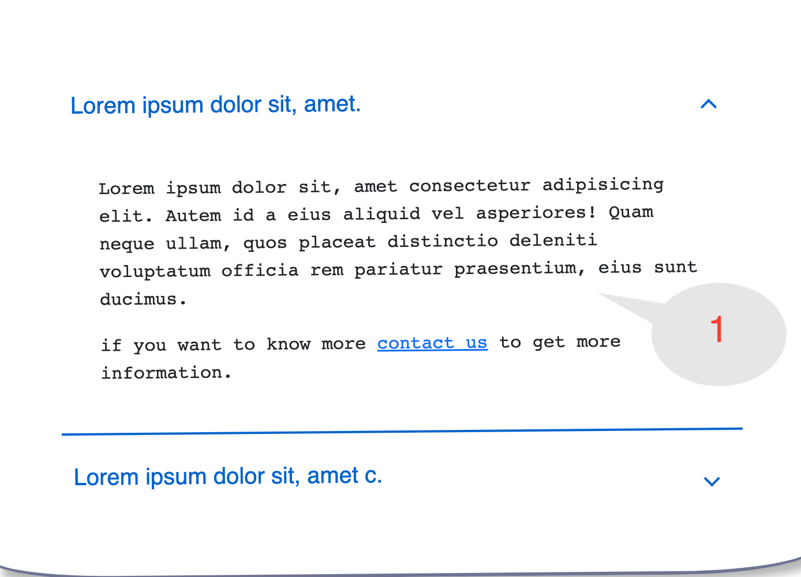
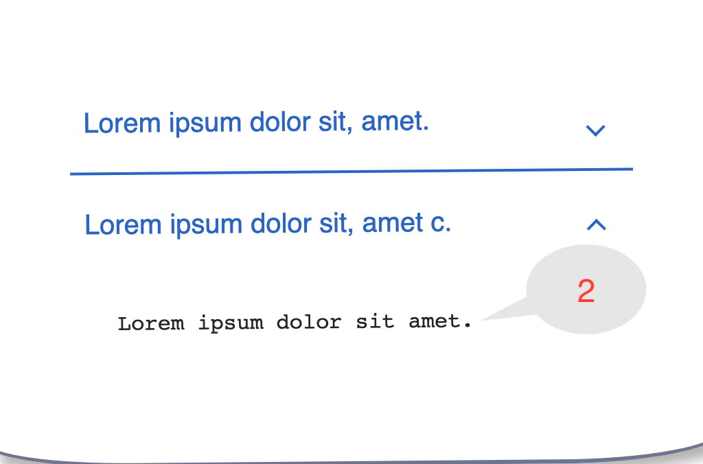

# Js type control usage
I created the component based on array or text by checking the type in the javascript, `if the type is array then I used a map` because there are multiple values. If it is plain text then I did not use a map.
```Javascript
{typeof item.desc == "object" ? 
    (
    item.desc.map((text) => <AddLinksToText text={text}/>)
    ) 
    : 
    (
    <AddLinksToText text={item.desc}/>
    )
}
```

| Desc as Array             |  Desc as Text |
:-------------------------:|:-------------------------:
 |  
content=[{title:"",desc:["",""]}] | content=[{title:"",desc:""}]